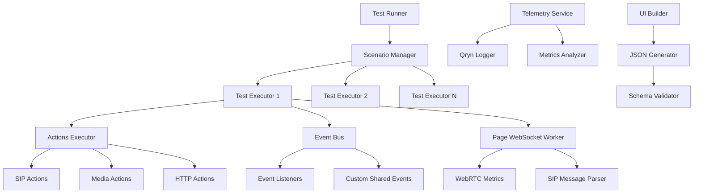

# 🚀 OpenSIPS-JS Testing Framework: The Ultimate SIP/WebRTC Test Automation Platform

[](https://opensource.org/licenses/MIT)
[](https://www.typescriptlang.org/)
[](https://playwright.dev/)

> **The world's most advanced, open-source testing framework for SIP communications and WebRTC applications.**

## 🌟 Table of Contents

- [🎯 Overview](#-overview)
- [🏗️ Architecture](#️-architecture)
- [🔑 Key Concepts](#-key-concepts)
- [⚡ Quick Start](#-quick-start)
- [🎭 Scenario Definition Methods](#-scenario-definition-methods)
- [🎬 Actions Reference](#-actions-reference)
- [📡 Events Reference](#-events-reference)
- [🔄 Context & Data Flow](#-context--data-flow)
- [⏱️ Wait Until Events (New!)](#️-wait-until-events-new)
- [✅ Expectations System](#-expectations-system)
- [📊 WebRTC Metrics & Telemetry](#-webrtc-metrics--telemetry)
- [🎨 Visual Scenario Builder UI](#-visual-scenario-builder-ui)
- [🔧 Advanced Configuration](#-advanced-configuration)
- [🚀 Extending the Framework](#-extending-the-framework)
- [📚 Complete Examples](#-complete-examples)
- [🐳 Docker & CI/CD](#-docker--cicd)
- [🔍 Troubleshooting](#-troubleshooting)

## 🎯 Overview

The OpenSIPS-JS Testing Framework is a **revolutionary, open-source testing platform** designed to automate the most complex SIP/WebRTC communication scenarios. Built with cutting-edge event-driven architecture, it provides unparalleled capabilities for:

### 🌟 **What Makes This Framework World-Class:**

- **🎭 Dual Definition Modes**: Type-safe method-based OR JSON-based scenario definitions
- **🔄 Multi-Event Waiting**: Wait for multiple events simultaneously with the new `waitUntil` array feature
- **🎯 Intelligent Expectations**: Advanced expectation system with WebSocket and response validation
- **📊 Real-time Telemetry**: Comprehensive WebRTC metrics collection and analysis
- **🎨 Visual Builder**: Intuitive UI for creating complex test scenarios
- **🌐 Environment Flexibility**: Nested environment variables with Docker-ready configuration
- **🔍 Context Templating**: Mustache-powered dynamic data injection
- **⚡ Parallel Execution**: Multi-scenario concurrent testing
- **📈 Quality Analytics**: Built-in call quality assessment and reporting
- **🏗️ Extensible Architecture**: Easy to add custom actions, events, and integrations

### 🎯 **Perfect For:**

- **SIP Communication Testing**: Registration, calling, transfers, hold/resume
- **WebRTC Quality Assurance**: Media metrics, connection analysis, performance testing
- **Integration Testing**: API-driven workflows with SIP endpoints
- **Load Testing**: Multiple concurrent scenarios
- **CI/CD Automation**: Docker-compatible, environment-driven testing
- **Debugging**: Rich logging, telemetry, and step-by-step execution tracking

## 🏗️ Architecture



### 🧩 **Core Components:**

- **🎭 Scenario Manager**: Orchestrates multiple test scenarios
- **⚡ Test Executor**: Manages individual scenario execution
- **🎬 Actions Executor**: Performs SIP, media, and HTTP operations
- **📡 Event Bus**: Central communication hub with custom event support
- **🌐 Page WebSocket Worker**: Real-time SIP message interception
- **📊 Telemetry Service**: Comprehensive metrics and logging
- **🎨 Visual UI Builder**: Drag-and-drop scenario creation
- **🔍 Schema Validator**: Ensures test integrity

## 🔑 Key Concepts

### 🎭 **Scenarios**
Self-contained test environments representing SIP endpoints (caller, callee, etc.)

### 📡 **Events**
Trigger points for actions:
- **System Events**: `ready`, `incoming`, `register`, etc.
- **Custom Shared Events**: Cross-scenario communication
- **SIP Protocol Events**: `INVITE`, `BYE`, `ACK`, etc.

### 🎬 **Actions**
Operations performed during testing:
- **SIP Actions**: Register, dial, answer, hangup
- **Media Actions**: Hold, transfer, play sound, DTMF
- **Utility Actions**: Wait, HTTP requests
- **Control Actions**: DND, unregister

### 🔄 **Context**
Dynamic data store supporting:
- Environment variables (nested with dot notation)
- Action responses
- Mustache templating
- Cross-scenario data sharing

## ⚡ Quick Start

### 📋 **Prerequisites**

```bash
# Required Software
Node.js >= 16.0.0
Playwright >= 1.30.0
Chrome/Chromium Browser
```

### 🚀 **Installation**

```bash
# Clone and setup
git clone <repository>
cd opensips-js/tests

# Install dependencies
npm install
# or
yarn install

# Install Playwright browsers
npx playwright install
```

### 🎯 **Your First Test**

```typescript
import TestScenariosBuilder from './services/TestScenariosBuilder'
import type { TestScenarios } from './types/intex'

export default class MyFirstTest extends TestScenariosBuilder {
    getInitialContext() {
        return {
            caller: {
                sip_domain: 'sip.example.com',
                username: 'alice',
                password: 'secret123',
            },
            callee: {
                sip_domain: 'sip.example.com',
                username: 'bob',
                password: 'secret456'
            }
        }
    }

    init(): TestScenarios {
        return [
            // 🎭 Caller Scenario
            this.createScenario('caller', [
                this.on('ready', [
                    this.register({
                        payload: {
                            sip_domain: '{{caller.sip_domain}}',
                            username: '{{caller.username}}',
                            password: '{{caller.password}}',
                        },
                        customSharedEvent: 'caller_registered'
                    })
                ]),
                this.on('callee_ready', [
                    this.dial({
                        payload: { target: '{{callee.username}}' },
                        customSharedEvent: 'call_initiated'
                    })
                ]),
                this.on('call_answered', [
                    this.wait({ payload: { time: 3000 } }),
                    this.hangup({ customSharedEvent: 'call_ended' })
                ])
            ]),

            // 🎭 Callee Scenario
            this.createScenario('callee', [
                this.on('ready', [
                    this.register({
                        payload: {
                            sip_domain: '{{callee.sip_domain}}',
                            username: '{{callee.username}}',
                            password: '{{callee.password}}',
                        },
                        customSharedEvent: 'callee_ready'
                    })
                ]),
                this.on('incoming', [
                    this.answer({ customSharedEvent: 'call_answered' })
                ]),
                this.on('call_ended', [
                    this.unregister()
                ])
            ])
        ]
    }
}
```

### 🏃‍♂️ **Run Your Test**

```typescript
// test-runner.ts
import MyFirstTest from './my-first-test'

async function runTest() {
    console.log('🚀 Starting OpenSIPS-JS Test')
    try {
        const testRunner = new MyFirstTest()
        await testRunner.run()
        console.log('✅ Test completed successfully!')
    } catch (error) {
        console.error('❌ Test failed:', error)
        process.exit(1)
    }
}

runTest()
```

```bash
# Execute
npm run test:my-first
# or
npx ts-node test-runner.ts
```

## 🎭 Scenario Definition Methods

### 🔧 **Method 1: Type-Safe Builder (Recommended for Development)**

```typescript
init(): TestScenarios {
    return [
        this.createScenario('advanced_caller', [
            this.on('ready', [
                // 🌐 API Integration
                this.request({
                    payload: {
                        url: 'https://api.voicenter.com/Auth/Login',
                        options: {
                            method: 'POST',
                            headers: { 'Content-Type': 'application/json' },
                            data: {
                                email: '{{CALLER.API.EMAIL}}',
                                password: '{{CALLER.API.PASSWORD}}'
                            }
                        }
                    },
                    responseToContext: {
                        setToContext: true,
                        contextKeyToSet: 'auth_response'
                    },
                    waitUntil: [
                        { event: 'callee_registered', timeout: 10000 },
                        { event: 'system_ready', timeout: 5000 }
                    ]
                }),
                
                // 🔐 Dynamic Registration
                this.register({
                    payload: {
                        sip_domain: '{{auth_response.domain}}',
                        username: '{{auth_response.extension}}',
                        password: '{{auth_response.password}}',
                    },
                    customSharedEvent: 'caller_registered',
                    expect: [
                        [
                            {
                                type: 'websocket',
                                method: 'REGISTER',
                                status_code: 200,
                                timeout: 5000
                            }
                        ]
                    ]
                })
            ])
        ])
    ]
}
```

### 📄 **Method 2: JSON-Based (Perfect for External Storage & Dynamic Generation)**

```json
{
  "scenarios": [
    {
      "name": "json_based_caller",
      "actions": [
        {
          "event": "ready",
          "actions": [
            {
              "type": "register",
              "data": {
                "payload": {
                  "sip_domain": "{{CALLER.SIP_DOMAIN}}",
                  "username": "{{CALLER.USERNAME}}",
                  "password": "{{CALLER.PASSWORD}}"
                },
                "waitUntil": [
                  {
                    "event": "callee_registered",
                    "timeout": 10000
                  },
                  {
                    "event": "network_ready",
                    "timeout": 5000
                  }
                ],
                "customSharedEvent": "caller_registered",
                "expect": [
                  [
                    {
                      "type": "websocket",
                      "method": "REGISTER",
                      "status_code": 200,
                      "description": "Successful registration expected"
                    }
                  ]
                ]
              }
            }
          ]
        }
      ]
    }
  ]
}
```

### 🤝 **Method 3: Hybrid Approach**

```typescript
init(): TestScenarios {
    // 🔧 Use builder for type safety during development
    const typedScenario = this.createScenario('caller', [
        this.on('ready', [
            this.register({
                payload: {
                    sip_domain: '{{caller.sip_domain}}',
                    username: '{{caller.username}}',
                    password: '{{caller.password}}',
                }
            })
        ])
    ])

    // 📄 Load scenarios from external JSON
    const jsonScenarios = this.loadFromJSON('./scenarios/complex-flow.json')
    
    // 🔄 Combine both approaches
    return [typedScenario, ...jsonScenarios]
}
```

## 🎬 Actions Reference

### 🔐 **Authentication Actions**

#### Register
```typescript
this.register({
    payload: {
        sip_domain: '{{DOMAIN}}',
        username: '{{USERNAME}}', 
        password: '{{PASSWORD}}'
    },
    waitUntil: [
        { event: 'network_ready', timeout: 5000 }
    ],
    customSharedEvent: 'user_registered',
    expect: [
        [
            {
                type: 'websocket',
                method: 'REGISTER',
                status_code: 200
            }
        ]
    ]
})
```

#### Unregister
```typescript
this.unregister({
    customSharedEvent: 'user_unregistered',
    expect: [
        [
            {
                type: 'response',
                properties: { success: true }
            }
        ]
    ]
})
```

### 📞 **Call Control Actions**

#### Dial with Advanced Features
```typescript
this.dial({
    payload: {
        target: '{{callee.username}}@{{callee.domain}}'
    },
    waitUntil: [
        { event: 'callee_registered', timeout: 10000 },
        { event: 'media_ready', timeout: 5000 }
    ],
    customSharedEvent: 'call_initiated',
    expect: [
        [
            {
                type: 'websocket',
                method: 'INVITE',
                status_code: 200,
                timeout: 15000,
                description: 'Successful call initiation'
            }
        ],
        [
            // Alternative expectation group (OR logic)
            {
                type: 'websocket',
                method: 'INVITE', 
                status_code: 180, // Ringing
                description: 'Call ringing response'
            }
        ]
    ]
})
```

#### Answer with Context
```typescript
this.answer({
    customSharedEvent: 'call_answered',
    responseToContext: {
        setToContext: true,
        contextKeyToSet: 'answered_call_data'
    }
})
```

#### Smart Hangup
```typescript
this.hangup({
    waitUntil: [
        { event: 'media_cleanup_complete', timeout: 3000 }
    ],
    customSharedEvent: 'call_terminated'
})
```

### 🎵 **Media Actions**

#### Hold with Notification
```typescript
this.hold({
    customSharedEvent: 'call_on_hold',
    expect: [
        [
            {
                type: 'websocket',
                method: 'INVITE',
                status_code: 200,
                description: 'Hold INVITE response'
            }
        ]
    ]
})
```

#### Play Sound
```typescript
this.playSound({
    payload: {
        sound: '/assets/audio/notification.wav'
    },
    waitUntil: [
        { event: 'audio_system_ready', timeout: 2000 }
    ],
    customSharedEvent: 'notification_played'
})
```

#### DTMF Sequences
```typescript
this.sendDTMF({
    payload: {
        dtmf: '1234#'
    },
    customSharedEvent: 'dtmf_sequence_sent',
    expect: [
        [
            {
                type: 'websocket',
                method: 'INFO',
                status_code: 200
            }
        ]
    ]
})
```

#### Call Transfer
```typescript
this.transfer({
    payload: {
        target: '{{transfer_target}}'
    },
    waitUntil: [
        { event: 'transfer_target_available', timeout: 8000 }
    ],
    customSharedEvent: 'transfer_initiated'
})
```

### 🌐 **HTTP Integration Actions**

#### API Authentication
```typescript
this.request({
    payload: {
        url: 'https://api.example.com/auth',
        options: {
            method: 'POST',
            headers: {
                'Content-Type': 'application/json',
                'X-API-Key': '{{API_KEY}}'
            },
            data: {
                username: '{{USERNAME}}',
                password: '{{PASSWORD}}'
            }
        }
    },
    responseToContext: {
        setToContext: true,
        contextKeyToSet: 'api_auth_response'
    },
    customSharedEvent: 'api_authenticated'
})
```

### ⚙️ **Utility Actions**

#### Smart Wait
```typescript
this.wait({
    payload: {
        time: 5000
    },
    waitUntil: [
        { event: 'background_process_complete', timeout: 10000 }
    ],
    customSharedEvent: 'wait_completed'
})
```

#### DND Control
```typescript
this.DND({
    customSharedEvent: 'dnd_enabled',
    expect: [
        [
            {
                type: 'response',
                properties: { success: true, dnd_status: true }
            }
        ]
    ]
})
```

## 📡 Events Reference

### 🔄 **Event Types & Scoping**

The framework provides sophisticated event handling with two distinct scoping mechanisms:

#### 🏠 **Local Events (Scenario-Scoped)**
These events are only delivered to the scenario that triggered them:
- `register`, `dial`, `answer`, `hangup`, `hold`, `unhold`
- `playSound`, `sendDTMF`, `transfer`, `unregister`, `DND`

#### 🌐 **Custom Shared Events (Cross-Scenario)**
Events that can be received by all scenarios:
- Any event defined via `customSharedEvent` property
- Perfect for synchronization between scenarios

#### 📟 **System Events**
Built-in framework events:
- `ready` - Test environment initialized
- `incoming` - Incoming call received

### 🎯 **SIP Protocol Events**

Automatically mapped from WebSocket SIP messages:

| SIP Method | Framework Event | Description |
|------------|----------------|-------------|
| `INVITE` | `incoming` | Incoming call invitation |
| `ACK` | `callConfirmed` | Call establishment confirmed |
| `CANCEL` | `callCancelled` | Call invitation cancelled |
| `BYE` | `callEnded` | Call termination |
| `UPDATE` | `callUpdated` | Call parameters updated |
| `MESSAGE` | `messageReceived` | SIP message received |
| `OPTIONS` | `optionsReceived` | Options query received |
| `REFER` | `callReferred` | Call transfer request |
| `INFO` | `infoReceived` | In-call information |
| `NOTIFY` | `notificationReceived` | Event notification |

### 🎭 **Custom Event Examples**

```typescript
// 🎯 Synchronization Events
this.on('caller_registered', [
    this.dial({ 
        payload: { target: '{{callee.username}}' },
        customSharedEvent: 'call_initiated'
    })
])

// 🔄 Multi-Stage Workflows
this.on('api_credentials_received', [
    this.register({
        payload: {
            sip_domain: '{{api_response.domain}}',
            username: '{{api_response.username}}',
            password: '{{api_response.password}}'
        },
        customSharedEvent: 'dynamic_registration_complete'
    })
])

// 🎵 Media Coordination
this.on('hold_music_ready', [
    this.hold({
        customSharedEvent: 'call_held_with_music'
    })
])
```

## 🔄 Context & Data Flow

### 🌍 **Environment Variables (Nested Support)**

The framework supports sophisticated environment variable handling with automatic "unflatifying":

```bash
# 📁 Flat Environment Variables
CALLER_USERNAME=alice
CALLER_PASSWORD=secret123
CALLER_DOMAIN=sip.example.com

# 🌳 Nested Environment Variables (Recommended)
CALLER.USERNAME=alice
CALLER.PASSWORD=secret123
CALLER.SIP_DOMAIN=sip.example.com

CALLEE.USERNAME=bob
CALLEE.PASSWORD=secret456
CALLEE.SIP_DOMAIN=sip.example.com

# 🌐 API Configuration
API.BASE_URL=https://api.voicenter.com
API.TIMEOUT=30000
API.RETRY_COUNT=3

# 🔧 Testing Configuration  
TEST.CALL_DURATION=10000
TEST.DTMF_SEQUENCE=1234#
TEST.AUDIO_FILE=./assets/test-audio.wav
```

**Automatic Context Generation:**
```javascript
{
  // Nested variables automatically become objects
  CALLER: {
    USERNAME: 'alice',
    PASSWORD: 'secret123', 
    SIP_DOMAIN: 'sip.example.com'
  },
  CALLEE: {
    USERNAME: 'bob',
    PASSWORD: 'secret456',
    SIP_DOMAIN: 'sip.example.com'
  },
  API: {
    BASE_URL: 'https://api.voicenter.com',
    TIMEOUT: 30000,
    RETRY_COUNT: 3
  },
  TEST: {
    CALL_DURATION: 10000,
    DTMF_SEQUENCE: '1234#',
    AUDIO_FILE: './assets/test-audio.wav'
  }
}
```

### 🎯 **Context Usage in Actions**

```typescript
this.register({
    payload: {
        sip_domain: '{{CALLER.SIP_DOMAIN}}',
        username: '{{CALLER.USERNAME}}',
        password: '{{CALLER.PASSWORD}}'
    },
    waitUntil: [
        { event: 'network_ready', timeout: '{{API.TIMEOUT}}' }
    ]
})
```

### 🔄 **Dynamic Context Updates**

```typescript
// 🌐 HTTP Response → Context
this.request({
    payload: {
        url: '{{API.BASE_URL}}/credentials',
        options: { method: 'GET' }
    },
    responseToContext: {
        setToContext: true,
        contextKeyToSet: 'dynamic_credentials'
    }
})

// 🎯 Use Dynamic Data
this.on('api_call_completed', [
    this.register({
        payload: {
            sip_domain: '{{dynamic_credentials.domain}}',
            username: '{{dynamic_credentials.username}}',
            password: '{{dynamic_credentials.password}}'
        }
    })
])
```

### 🎨 **Mustache Templating Features**

```typescript
// 🔤 String Interpolation
target: '{{callee.username}}@{{callee.domain}}'

// 🔢 Numeric Operations
timeout: '{{API.TIMEOUT}}' // Automatically converted to number

// 🏗️ Object Access
authorization: 'Bearer {{auth_response.data.access_token}}'

// 🎯 Conditional Logic (Advanced)
target: '{{#premium_user}}premium-{{callee.username}}{{/premium_user}}{{^premium_user}}{{callee.username}}{{/premium_user}}'
```

## ⏱️ Wait Until Events (New!)

### 🚀 **Revolutionary Multi-Event Waiting**

The new `waitUntil` array feature allows actions to wait for multiple events simultaneously, enabling sophisticated synchronization patterns:

#### 🔧 **Single Event Wait (Legacy)**
```typescript
waitUntil: {
    event: 'callee_registered',
    timeout: 5000
}
```

#### 🌟 **Multi-Event Wait (New!)**
```typescript
waitUntil: [
    { event: 'callee_registered', timeout: 10000 },
    { event: 'media_system_ready', timeout: 5000 },
    { event: 'network_stable', timeout: 8000 }
]
```

### 🎯 **Advanced Wait Patterns**

#### 🔄 **Complex Synchronization**
```typescript
this.dial({
    payload: { target: '{{callee.username}}' },
    waitUntil: [
        { event: 'callee_registered', timeout: 15000 },
        { event: 'caller_media_ready', timeout: 10000 },
        { event: 'network_quality_good', timeout: 5000 },
        { event: 'background_services_ready', timeout: 20000 }
    ],
    customSharedEvent: 'synchronized_call_initiated'
})
```

#### 🎵 **Media Coordination**
```typescript
this.playSound({
    payload: { sound: '/audio/greeting.wav' },
    waitUntil: [
        { event: 'call_established', timeout: 10000 },
        { event: 'audio_output_ready', timeout: 3000 },
        { event: 'volume_adjusted', timeout: 2000 }
    ],
    customSharedEvent: 'greeting_played'
})
```

#### 🌐 **API Integration Wait**
```typescript
this.request({
    payload: {
        url: '{{API.BASE_URL}}/user/profile',
        options: { method: 'GET' }
    },
    waitUntil: [
        { event: 'authentication_complete', timeout: 5000 },
        { event: 'rate_limit_cleared', timeout: 10000 },
        { event: 'cache_warmed', timeout: 3000 }
    ],
    responseToContext: {
        setToContext: true,
        contextKeyToSet: 'user_profile'
    }
})
```

### ⚡ **Wait Timeout Strategies**

```typescript
// 🎯 Individual Timeouts
waitUntil: [
    { event: 'critical_event', timeout: 30000 },     // Long timeout for critical
    { event: 'optional_event', timeout: 2000 },      // Short timeout for optional  
    { event: 'background_task', timeout: 60000 }     // Extended for background
]

// 🔄 No Timeout (Wait Indefinitely)
waitUntil: [
    { event: 'user_interaction' },  // No timeout specified
    { event: 'system_ready', timeout: 10000 }
]
```

### 🏗️ **JSON Schema Support**

```json
{
  "type": "dial",
  "data": {
    "payload": {
      "target": "{{callee.username}}"
    },
    "waitUntil": [
      {
        "event": "callee_registered",
        "timeout": 15000
      },
      {
        "event": "media_ready", 
        "timeout": 5000
      }
    ],
    "customSharedEvent": "call_initiated"
  }
}
```

## ✅ Expectations System

### 🎯 **Advanced Expectation Validation**

The framework includes a sophisticated expectations system for validating action outcomes:

#### 🌐 **WebSocket Expectations**
```typescript
expect: [
    [
        {
            type: 'websocket',
            method: 'INVITE',
            status_code: 200,
            timeout: 10000,
            checkSentEvent: true,
            description: 'Successful call invitation'
        }
    ]
]
```

#### 📊 **Response Expectations** 
```typescript
expect: [
    [
        {
            type: 'response',
            properties: {
                success: true,
                callId: '{{expected_call_id}}',
                target: '{{callee.username}}'
            },
            description: 'Valid dial response structure'
        }
    ]
]
```

### 🔄 **Expectation Logic (OR/AND)**

```typescript
// 🎯 Multiple Expectation Groups (OR Logic)
expect: [
    // Group 1: Success Path
    [
        {
            type: 'websocket',
            method: 'INVITE',
            status_code: 200
        }
    ],
    // Group 2: Alternative Success (Ringing)
    [
        {
            type: 'websocket', 
            method: 'INVITE',
            status_code: 180
        }
    ]
]

// 🔗 Multiple Expectations per Group (AND Logic)
expect: [
    [
        {
            type: 'websocket',
            method: 'INVITE', 
            status_code: 200
        },
        {
            type: 'response',
            properties: {
                success: true,
                callId: '{{dynamic_call_id}}'
            }
        }
    ]
]
```

### 🎭 **Default vs Custom Expectations**

```typescript
// 🏭 Framework provides default expectations for common actions
this.dial({
    payload: { target: '{{callee.username}}' }
    // No expect defined - uses default INVITE 200 expectation
})

// 🎨 Override with custom expectations
this.dial({
    payload: { target: '{{callee.username}}' },
    expect: [
        [
            {
                type: 'websocket',
                method: 'INVITE',
                status_code: 486, // Busy
                description: 'Expecting busy response'
            }
        ]
    ]
})
```

### 🔍 **Dynamic Expectation Properties**

```typescript
expect: [
    [
        {
            type: 'response',
            properties: {
                success: true,
                callId: '{{context.expected_call_id}}',
                target: '{{callee.username}}@{{callee.domain}}',
                timestamp: '{{current_timestamp}}'
            }
        }
    ]
]
```

## 📊 WebRTC Metrics & Telemetry

### 📈 **Comprehensive Metrics Collection**

The framework automatically collects detailed WebRTC and call quality metrics:

#### 🎵 **Audio Metrics**
- **Packet Statistics**: Sent, received, lost packets
- **Quality Metrics**: Jitter, round-trip time, audio levels
- **Bandwidth Usage**: Bitrate, codec efficiency
- **Processing Data**: Echo cancellation, noise suppression

#### 📊 **Connection Metrics**
- **Setup Time**: Connection establishment duration
- **Stability**: Connection drops, reconnections
- **Quality Assessment**: MOS scores, degradation events

#### 🔍 **Call Analytics**
```typescript
// 📊 Automatic metrics collection during calls
const metrics = await this.page.evaluate(() => {
    return window.WebRTCMetricsCollector.getCallMetrics()
})

console.log('📈 Call Quality Report:', {
    setupTime: metrics.setupTime,
    totalDuration: metrics.totalDuration,
    avgPacketLoss: metrics.avgPacketLoss,
    avgJitter: metrics.avgJitter,
    audioQuality: metrics.qualityScore,
    connectionStability: metrics.stabilityScore
})
```

### 📡 **Telemetry Integration**

#### 🔍 **Qryn Logger Integration**
```typescript
// 🎯 Structured logging with scenario context
this.logger.log('Call initiated', {
    scenario: 'caller',
    target: '{{callee.username}}',
    timestamp: Date.now(),
    callId: '{{call_id}}'
})
```

#### 📊 **OpenTelemetry Support**
```typescript
// 🌐 Distributed tracing for complex flows
const span = this.telemetryService.startActionSpan('dial', actionData)
try {
    // Execute action
    await this.dial(payload)
    span.setStatus({ code: SpanStatusCode.OK })
} catch (error) {
    span.recordException(error)
    span.setStatus({ code: SpanStatusCode.ERROR })
} finally {
    span.end()
}
```

### 📈 **Quality Analysis**

```typescript
// 🎯 Automated quality assessment
const qualityAnalysis = WebRTCMetricsAnalyzer.analyzeCallQuality(metrics)

console.log('🏆 Quality Report:', {
    overallScore: qualityAnalysis.score,
    issues: qualityAnalysis.issues,
    recommendations: qualityAnalysis.recommendations,
    passedThresholds: qualityAnalysis.passedThresholds
})
```

## 🎨 Visual Scenario Builder UI

### 🖥️ **Intuitive Web Interface**

The framework includes a powerful visual builder for creating test scenarios without coding:

#### 🚀 **Getting Started with UI**

```bash
# 📁 Navigate to UI directory
cd tests/ui

# 📦 Install dependencies
npm install
# or  
yarn install

# 🚀 Start development server
npm run dev
# or
yarn dev

# 🌐 Open browser
open http://localhost:3000
```

#### ⚙️ **Environment Configuration**

```bash
# 📝 .env file
JSON_FILES_PATH=tests/core/samples/e2e
API_BASE_URL=http://localhost:3001
WEBSOCKET_URL=ws://localhost:8080
```

### 🎯 **UI Features**

#### 📋 **Scenario Management**
- **📁 File Browser**: Browse and edit existing scenarios
- **➕ Scenario Creation**: Drag-and-drop scenario builder
- **🔄 Real-time Preview**: Live JSON generation
- **✅ Validation**: Real-time schema validation
- **💾 Auto-save**: Automatic saving of changes

#### 🎬 **Action Builder**
- **🎯 Action Palette**: All available actions with descriptions
- **🔧 Property Editor**: Visual property configuration
- **⏱️ Wait Until Editor**: Multi-event wait configuration
- **✅ Expectation Builder**: Visual expectation setup
- **🎨 Event Mapping**: Custom shared event configuration

#### 🔄 **Advanced Features**
- **🎭 Multi-scenario Editing**: Work with multiple scenarios
- **🔍 Context Explorer**: Browse available context variables
- **📊 Validation Reports**: Detailed error reporting
- **🎨 Syntax Highlighting**: JSON with TypeScript hints
- **📤 Export Options**: JSON, TypeScript, or YAML export

### 🎯 **UI Components Overview**

#### 📋 **JsonFilesList.vue**
```vue
<template>
  <div class="file-browser">
    <JsonFilesList 
      @file-selected="loadScenario"
      @file-created="createNewScenario"
      @file-deleted="deleteScenario"
    />
  </div>
</template>
```

#### 🎬 **JsonEventAction.vue** 
```vue
<template>
  <div class="action-editor">
    <JsonEventAction
      v-model="action"
      :type-options="actionTypes"
      @action:copy="duplicateAction"
      @action:remove="removeAction"
    />
  </div>
</template>
```

#### ⏱️ **WaitUntilForm.vue**
```vue
<template>
  <div class="wait-until-editor">
    <div v-for="(waitItem, index) in waitUntilArray" :key="index">
      <WaitUntilForm
        v-model="waitUntilArray[index]"
        @remove="removeWaitUntilItem(index)"
      />
    </div>
    <button @click="addWaitUntilItem">Add Wait Event</button>
  </div>
</template>
```

## 🔧 Advanced Configuration

### 🌍 **Environment Profiles**

```bash
# 🏭 Production Environment
ENVIRONMENT=production
CALLER.SIP_DOMAIN=prod-sip.example.com
CALLER.USERNAME=prod_caller
CALLER.PASSWORD=${PROD_CALLER_PASSWORD}

CALLEE.SIP_DOMAIN=prod-sip.example.com  
CALLEE.USERNAME=prod_callee
CALLEE.PASSWORD=${PROD_CALLEE_PASSWORD}

API.BASE_URL=https://prod-api.example.com
API.TIMEOUT=30000

# 🧪 Testing Environment
ENVIRONMENT=testing
CALLER.SIP_DOMAIN=test-sip.example.com
CALLER.USERNAME=test_caller
CALLER.PASSWORD=test123

CALLEE.SIP_DOMAIN=test-sip.example.com
CALLEE.USERNAME=test_callee  
CALLEE.PASSWORD=test456

API.BASE_URL=https://test-api.example.com
API.TIMEOUT=10000
```

### 🎯 **Scenario Configuration**

```typescript
// 🔧 Advanced scenario configuration
export default class AdvancedTestScenarios extends TestScenariosBuilder {
    constructor() {
        super()
        
        // 🎯 Configure scenario options
        this.setGlobalTimeout(60000)
        this.setRetryCount(3)
        this.setParallelExecution(true)
        this.setMetricsCollection(true)
    }

    getInitialContext() {
        return {
            // 🌍 Environment-specific configuration
            environment: process.env.ENVIRONMENT || 'development',
            
            // 🎯 Test-specific settings
            test: {
                callDuration: parseInt(process.env.TEST_CALL_DURATION) || 10000,
                expectedQuality: process.env.TEST_EXPECTED_QUALITY || 'good',
                retryOnFailure: process.env.TEST_RETRY === 'true'
            },
            
            // 🔧 Dynamic configuration
            ...this.loadConfigFromEnvironment()
        }
    }
}
```

### 📊 **Metrics Configuration**

```typescript
// 🎯 Configure WebRTC metrics collection
this.setMetricsConfig({
    collectAudioMetrics: true,
    collectVideoMetrics: false,
    metricsInterval: 1000,
    exportFormat: 'prometheus',
    qrynEndpoint: process.env.QRYN_ENDPOINT,
    telemetryEnabled: true
})
```

### 🎨 **Browser Configuration**

```typescript
// 🌐 Advanced browser setup
const browserConfig = {
    headless: process.env.HEADLESS === 'true',
    slowMo: parseInt(process.env.SLOW_MO) || 0,
    args: [
        '--allow-file-access',
        '--autoplay-policy=no-user-gesture-required',
        '--disable-web-security',
        '--allow-running-insecure-content',
        '--use-fake-ui-for-media-stream',
        '--use-fake-device-for-media-stream'
    ],
    recordVideo: process.env.RECORD_VIDEO === 'true',
    recordHar: process.env.RECORD_HAR === 'true'
}
```

## 🚀 Extending the Framework

### ➕ **Adding Custom Actions**

#### 1️⃣ **Define Action Types**

```typescript
// 📁 types/actions.ts

// 🎯 Custom action payload
interface CustomActionPayload {
    customParam1: string
    customParam2: number
    options?: {
        timeout?: number
        retries?: number
    }
}

// 📊 Custom action response
interface CustomActionSuccessResponse extends BaseActionSuccessResponse {
    success: true
    customResult: any
    processingTime: number
}

// 🎬 Action definition
export type CustomAction = Action<
    'customAction',
    CustomActionPayload,
    CustomActionSuccessResponse
>

// 🗺️ Add to actions map
export interface ActionsMap {
    // ... existing actions
    customAction: CustomAction
}
```

#### 2️⃣ **Implement Action Executor**

```typescript
// 📁 services/ActionsExecutor.ts

public async customAction(
    payload: GetActionPayload<CustomAction>
): Promise<GetActionResponse<CustomAction>> {
    const startTime = Date.now()
    
    await this.logger.log('Executing custom action', {
        payload: JSON.stringify(payload)
    })

    try {
        // 🎯 Custom action implementation
        const result = await this.performCustomOperation(payload)
        
        const processingTime = Date.now() - startTime
        
        return {
            success: true,
            customResult: result,
            processingTime
        }
    } catch (error) {
        await this.logger.error('Custom action failed', {
            error: error.message,
            payload: JSON.stringify(payload)
        })
        
        return {
            success: false,
            error: error.message
        }
    }
}

private async performCustomOperation(payload: CustomActionPayload) {
    // 🔧 Your custom logic here
    await this.page.evaluate((params) => {
        // Browser-side operations
        return window.customAPI.performAction(params)
    }, payload)
}
```

#### 3️⃣ **Add Builder Method**

```typescript
// 📁 services/TestScenariosBuilder.ts

public customAction(
    data: GetActionData<CustomAction>
): GetActionDefinition<CustomAction> {
    return {
        type: 'customAction',
        data
    }
}
```

#### 4️⃣ **Update Test Executor**

```typescript
// 📁 services/TestExecutor.ts

switch (actionType) {
    // ... existing cases
    case 'customAction':
        result = await this.actionsExecutor.customAction(
            this.buildPayload('customAction', action)
        )
        break
}
```

### 📡 **Adding Custom Events**

```typescript
// 📁 types/events.d.ts

export interface EventsMap {
    // ... existing events
    customEvent: AllowedActions<'register' | 'dial' | 'customAction'>
    anotherCustomEvent: AllowedActions<'answer' | 'hangup'>
}
```

### 🎯 **Custom Event Handlers**

```typescript
// 📁 services/PageWebSocketWorker.ts

// 🌐 Add SIP message mapping
this.pageWebSocketWorker = new PageWebSocketWorker(
    this.page,
    {
        // ... existing mappings
        CUSTOM_SIP_METHOD: 'customEvent',
        ANOTHER_METHOD: 'anotherCustomEvent'
    },
    this.triggerLocalEventListener.bind(this)
)
```

### 🎨 **Custom UI Components**

```vue
<!-- 📁 components/data/CustomActionForm.vue -->
<template>
  <div class="custom-action-form">
    <VcFormItem label="Custom Parameter 1">
      <VcInput v-model="localModel.customParam1" />
    </VcFormItem>
    
    <VcFormItem label="Custom Parameter 2">
      <VcInputNumber v-model="localModel.customParam2" />
    </VcFormItem>
    
    <VcFormItem label="Options">
      <div class="grid grid-cols-2 gap-4">
        <VcInputNumber 
          v-model="localModel.options.timeout"
          placeholder="Timeout (ms)"
        />
        <VcInputNumber
          v-model="localModel.options.retries" 
          placeholder="Retry Count"
        />
      </div>
    </VcFormItem>
  </div>
</template>

<script setup lang="ts">
interface CustomActionFormData {
  customParam1: string
  customParam2: number
  options: {
    timeout?: number
    retries?: number
  }
}

const props = defineProps<{
  modelValue: CustomActionFormData
}>()

const emit = defineEmits<{
  (e: 'update:modelValue', value: CustomActionFormData): void
}>()

const localModel = useVModel(props, 'modelValue', emit)
</script>
```

## 📚 Complete Examples

### 🎯 **Example 1: E2E API-Driven Call Flow**

```typescript
export default class APICallFlowTest extends TestScenariosBuilder {
    getInitialContext() {
        return {
            api: {
                baseUrl: process.env.API_BASE_URL,
                timeout: parseInt(process.env.API_TIMEOUT) || 30000
            }
        }
    }

    init(): TestScenarios {
        return [
            // 🎭 Caller Scenario
            this.createScenario('api_caller', [
                this.on('ready', [
                    // 🔐 Authenticate via API
                    this.request({
                        payload: {
                            url: '{{api.baseUrl}}/auth/login',
                            options: {
                                method: 'POST',
                                headers: { 'Content-Type': 'application/json' },
                                data: {
                                    email: '{{CALLER.API.EMAIL}}',
                                    password: '{{CALLER.API.PASSWORD}}'
                                }
                            }
                        },
                        responseToContext: {
                            setToContext: true,
                            contextKeyToSet: 'caller_auth'
                        },
                        waitUntil: [
                            { event: 'callee_authenticated', timeout: 30000 }
                        ]
                    }),

                    // 🔧 Get SIP credentials
                    this.request({
                        payload: {
                            url: '{{api.baseUrl}}/user/sip-settings',
                            options: {
                                method: 'GET',
                                headers: {
                                    'Authorization': 'Bearer {{caller_auth.response.Data.AccessToken}}'
                                }
                            }
                        },
                        responseToContext: {
                            setToContext: true,
                            contextKeyToSet: 'caller_sip_config'
                        }
                    }),

                    // 📞 Register with dynamic credentials
                    this.register({
                        payload: {
                            sip_domain: '{{caller_sip_config.response.WebRTCData.domain}}',
                            username: '{{caller_sip_config.response.WebRTCData.extension_user}}',
                            password: '{{caller_sip_config.response.WebRTCData.extension_pass}}'
                        },
                        customSharedEvent: 'caller_registered',
                        expect: [
                            [
                                {
                                    type: 'websocket',
                                    method: 'REGISTER',
                                    status_code: 200,
                                    timeout: 10000
                                }
                            ]
                        ]
                    })
                ]),

                this.on('callee_ready_for_calls', [
                    // 📞 Initiate call
                    this.dial({
                        payload: {
                            target: '{{callee_sip_config.response.WebRTCData.extension_user}}'
                        },
                        waitUntil: [
                            { event: 'media_systems_ready', timeout: 5000 }
                        ],
                        customSharedEvent: 'call_initiated',
                        expect: [
                            [
                                {
                                    type: 'websocket',
                                    method: 'INVITE',
                                    status_code: 200,
                                    timeout: 15000
                                }
                            ],
                            [
                                {
                                    type: 'websocket',
                                    method: 'INVITE',
                                    status_code: 180, // Ringing acceptable
                                    timeout: 10000
                                }
                            ]
                        ]
                    })
                ]),

                this.on('call_answered', [
                    // 🎵 Test media features
                    this.wait({ payload: { time: 2000 } }),
                    
                    this.hold({
                        customSharedEvent: 'call_held',
                        expect: [
                            [
                                {
                                    type: 'websocket',
                                    method: 'INVITE',
                                    status_code: 200
                                }
                            ]
                        ]
                    })
                ]),

                this.on('hold_music_finished', [
                    this.unhold({
                        customSharedEvent: 'call_resumed'
                    }),
                    
                    // 🔢 Send DTMF sequence
                    this.sendDTMF({
                        payload: { dtmf: '{{TEST.DTMF_SEQUENCE}}' },
                        customSharedEvent: 'dtmf_sent'
                    })
                ]),

                this.on('dtmf_acknowledged', [
                    this.wait({ payload: { time: 3000 } }),
                    
                    this.hangup({
                        customSharedEvent: 'call_ended',
                        expect: [
                            [
                                {
                                    type: 'websocket',
                                    method: 'BYE',
                                    status_code: 200
                                }
                            ]
                        ]
                    })
                ]),

                this.on('call_ended', [
                    this.unregister()
                ])
            ]),

            // 🎭 Callee Scenario  
            this.createScenario('api_callee', [
                this.on('ready', [
                    // 🔐 Authenticate callee
                    this.request({
                        payload: {
                            url: '{{api.baseUrl}}/auth/login',
                            options: {
                                method: 'POST',
                                headers: { 'Content-Type': 'application/json' },
                                data: {
                                    email: '{{CALLEE.API.EMAIL}}',
                                    password: '{{CALLEE.API.PASSWORD}}'
                                }
                            }
                        },
                        responseToContext: {
                            setToContext: true,
                            contextKeyToSet: 'callee_auth'
                        },
                        customSharedEvent: 'callee_authenticated'
                    }),

                    // 🔧 Get callee SIP settings
                    this.request({
                        payload: {
                            url: '{{api.baseUrl}}/user/sip-settings',
                            options: {
                                method: 'GET',
                                headers: {
                                    'Authorization': 'Bearer {{callee_auth.response.Data.AccessToken}}'
                                }
                            }
                        },
                        responseToContext: {
                            setToContext: true,
                            contextKeyToSet: 'callee_sip_config'
                        }
                    }),

                    // 📞 Register callee
                    this.register({
                        payload: {
                            sip_domain: '{{callee_sip_config.response.WebRTCData.domain}}',
                            username: '{{callee_sip_config.response.WebRTCData.extension_user}}',
                            password: '{{callee_sip_config.response.WebRTCData.extension_pass}}'
                        },
                        customSharedEvent: 'callee_ready_for_calls'
                    })
                ]),

                this.on('incoming', [
                    this.answer({
                        customSharedEvent: 'call_answered'
                    })
                ]),

                this.on('call_held', [
                    // 🎵 Play hold music
                    this.playSound({
                        payload: {
                            sound: '{{TEST.HOLD_MUSIC_FILE}}'
                        },
                        customSharedEvent: 'hold_music_finished'
                    })
                ]),

                this.on('dtmf_sent', [
                    // 🔢 Acknowledge DTMF
                    this.wait({ payload: { time: 1000 } }),
                    // Could trigger a custom shared event to acknowledge DTMF
                    this.playSound({
                        payload: {
                            sound: '{{TEST.DTMF_ACK_SOUND}}'
                        },
                        customSharedEvent: 'dtmf_acknowledged'
                    })
                ]),

                this.on('call_ended', [
                    this.unregister()
                ])
            ])
        ]
    }
}
```

### 🎯 **Example 2: Complex Multi-Party Call**

```typescript
export default class ConferenceCallTest extends TestScenariosBuilder {
    init(): TestScenarios {
        return [
            // 🎭 Host Scenario
            this.createScenario('conference_host', [
                this.on('ready', [
                    this.register({
                        payload: {
                            sip_domain: '{{HOST.SIP_DOMAIN}}',
                            username: '{{HOST.USERNAME}}', 
                            password: '{{HOST.PASSWORD}}'
                        },
                        customSharedEvent: 'host_registered'
                    })
                ]),

                this.on('all_participants_ready', [
                    // 📞 Call participant 1
                    this.dial({
                        payload: { target: '{{PARTICIPANT1.USERNAME}}' },
                        waitUntil: [
                            { event: 'participant1_media_ready', timeout: 10000 }
                        ],
                        customSharedEvent: 'host_calling_p1'
                    })
                ]),

                this.on('p1_answered', [
                    // 📞 Call participant 2
                    this.dial({
                        payload: { target: '{{PARTICIPANT2.USERNAME}}' },
                        waitUntil: [
                            { event: 'participant2_media_ready', timeout: 10000 }
                        ],
                        customSharedEvent: 'host_calling_p2'
                    })
                ]),

                this.on('conference_established', [
                    // 🎵 Play conference start sound
                    this.playSound({
                        payload: { sound: '{{CONFERENCE.START_SOUND}}' },
                        customSharedEvent: 'conference_started'
                    }),

                    // ⏰ Conference duration
                    this.wait({
                        payload: { time: parseInt('{{CONFERENCE.DURATION}}') },
                        customSharedEvent: 'conference_time_up'
                    })
                ]),

                this.on('conference_time_up', [
                    this.playSound({
                        payload: { sound: '{{CONFERENCE.END_SOUND}}' },
                        customSharedEvent: 'conference_ending'
                    }),

                    this.wait({ payload: { time: 3000 } }),

                    this.hangup({
                        customSharedEvent: 'conference_ended'
                    })
                ])
            ]),

            // 🎭 Participant 1
            this.createScenario('participant1', [
                this.on('ready', [
                    this.register({
                        payload: {
                            sip_domain: '{{PARTICIPANT1.SIP_DOMAIN}}',
                            username: '{{PARTICIPANT1.USERNAME}}',
                            password: '{{PARTICIPANT1.PASSWORD}}'
                        },
                        customSharedEvent: 'p1_registered'
                    })
                ]),

                this.on('host_calling_p1', [
                    this.answer({
                        customSharedEvent: 'p1_answered'
                    })
                ]),

                this.on('conference_started', [
                    // 🎤 Participant 1 contribution
                    this.wait({ payload: { time: 5000 } }),
                    this.playSound({
                        payload: { sound: '{{PARTICIPANT1.INTRO_SOUND}}' },
                        customSharedEvent: 'p1_introduced'
                    })
                ]),

                this.on('conference_ended', [
                    this.unregister()
                ])
            ]),

            // 🎭 Participant 2  
            this.createScenario('participant2', [
                this.on('ready', [
                    this.register({
                        payload: {
                            sip_domain: '{{PARTICIPANT2.SIP_DOMAIN}}',
                            username: '{{PARTICIPANT2.USERNAME}}',
                            password: '{{PARTICIPANT2.PASSWORD}}'
                        },
                        customSharedEvent: 'p2_registered'
                    })
                ]),

                this.on('p1_registered', [
                    // 🔄 Wait for both participants before signaling ready
                    this.wait({
                        payload: { time: 1000 },
                        customSharedEvent: 'all_participants_ready'
                    })
                ]),

                this.on('host_calling_p2', [
                    this.answer({
                        customSharedEvent: 'p2_answered'
                    })
                ]),

                this.on('p2_answered', [
                    // 🎉 Conference is now established
                    this.wait({
                        payload: { time: 500 },
                        customSharedEvent: 'conference_established'
                    })
                ]),

                this.on('p1_introduced', [
                    // 🎤 Participant 2 response
                    this.wait({ payload: { time: 2000 } }),
                    this.playSound({
                        payload: { sound: '{{PARTICIPANT2.RESPONSE_SOUND}}' }
                    })
                ]),

                this.on('conference_ended', [
                    this.unregister()
                ])
            ])
        ]
    }
}
```

### 🎯 **Example 3: Load Testing Scenario**

```typescript
export default class LoadTestScenarios extends TestScenariosBuilder {
    getInitialContext() {
        const participantCount = parseInt(process.env.LOAD_TEST_PARTICIPANTS) || 10
        const participants = []
        
        // 🏭 Generate participant configurations
        for (let i = 1; i <= participantCount; i++) {
            participants.push({
                username: `load_test_user_${i}`,
                password: `pass_${i}`,
                sip_domain: process.env.LOAD_TEST_DOMAIN,
                delay: i * 1000 // Stagger registrations
            })
        }
        
        return { participants, loadTest: { duration: 60000 } }
    }

    init(): TestScenarios {
        const scenarios: TestScenarios = []
        
        // 🎭 Generate scenarios for each participant
        this.context.participants.forEach((participant, index) => {
            scenarios.push(
                this.createScenario(`load_participant_${index}`, [
                    this.on('ready', [
                        // ⏰ Staggered registration
                        this.wait({
                            payload: { time: participant.delay }
                        }),
                        
                        this.register({
                            payload: {
                                sip_domain: participant.sip_domain,
                                username: participant.username,
                                password: participant.password
                            },
                            customSharedEvent: `participant_${index}_registered`,
                            expect: [
                                [
                                    {
                                        type: 'websocket',
                                        method: 'REGISTER',
                                        status_code: 200,
                                        timeout: 30000 // Longer timeout for load testing
                                    }
                                ]
                            ]
                        })
                    ]),

                    this.on(`participant_${index}_registered`, [
                        // 📞 Start making calls
                        this.dial({
                            payload: {
                                target: this.getRandomTarget(index)
                            },
                            waitUntil: [
                                { 
                                    event: 'load_test_calls_allowed', 
                                    timeout: 60000 
                                }
                            ],
                            customSharedEvent: `call_${index}_initiated`
                        })
                    ]),

                    this.on('incoming', [
                        // 📞 Answer incoming calls
                        this.answer({
                            customSharedEvent: `call_${index}_answered`
                        })
                    ]),

                    this.on(`call_${index}_answered`, [
                        // 🎵 Simulate call activity
                        this.wait({
                            payload: { 
                                time: Math.random() * 30000 + 10000 // 10-40 seconds
                            }
                        }),

                        this.hangup({
                            customSharedEvent: `call_${index}_ended`
                        })
                    ]),

                    this.on('load_test_complete', [
                        this.unregister()
                    ])
                ])
            )
        })

        // 🎛️ Add controller scenario
        scenarios.push(
            this.createScenario('load_test_controller', [
                this.on('ready', [
                    // ⏰ Wait for registrations
                    this.wait({
                        payload: { time: 30000 },
                        customSharedEvent: 'load_test_calls_allowed'
                    }),

                    // ⏰ Test duration
                    this.wait({
                        payload: { time: this.context.loadTest.duration },
                        customSharedEvent: 'load_test_complete'
                    })
                ])
            ])
        )

        return scenarios
    }

    private getRandomTarget(excludeIndex: number): string {
        const participants = this.context.participants
        let targetIndex
        
        do {
            targetIndex = Math.floor(Math.random() * participants.length)
        } while (targetIndex === excludeIndex)
        
        return participants[targetIndex].username
    }
}
```

## 🐳 Docker & CI/CD

### 🐳 **Docker Configuration**

```dockerfile
# 📁 Dockerfile
FROM mcr.microsoft.com/playwright:v1.40.0-focal

# 🔧 Set working directory
WORKDIR /app

# 📦 Copy package files
COPY package*.json yarn.lock ./
COPY tests/package*.json tests/

# 📦 Install dependencies
RUN npm install

# 📁 Copy test files
COPY tests/ tests/
COPY src/ src/

# 🌐 Install browsers
RUN npx playwright install

# 🎯 Default command
CMD ["npm", "run", "test:docker"]
```

```yaml
# 📁 docker-compose.yml
version: '3.8'

services:
  opensips-test:
    build: .
    environment:
      # 🌍 Test Environment
      - ENVIRONMENT=docker
      
      # 🔐 Caller Configuration
      - CALLER.SIP_DOMAIN=${CALLER_SIP_DOMAIN}
      - CALLER.USERNAME=${CALLER_USERNAME}
      - CALLER.PASSWORD=${CALLER_PASSWORD}
      - CALLER.API.EMAIL=${CALLER_API_EMAIL}
      - CALLER.API.PASSWORD=${CALLER_API_PASSWORD}
      
      # 🔐 Callee Configuration
      - CALLEE.SIP_DOMAIN=${CALLEE_SIP_DOMAIN}
      - CALLEE.USERNAME=${CALLEE_USERNAME}
      - CALLEE.PASSWORD=${CALLEE_PASSWORD}
      - CALLEE.API.EMAIL=${CALLEE_API_EMAIL}
      - CALLEE.API.PASSWORD=${CALLEE_API_PASSWORD}
      
      # 🌐 API Configuration
      - API.BASE_URL=${API_BASE_URL}
      - API.TIMEOUT=30000
      
      # 🎯 Test Configuration
      - TEST.CALL_DURATION=10000
      - TEST.DTMF_SEQUENCE=1234#
      - TEST.EXPECTED_QUALITY=good
      
      # 📊 Metrics Configuration
      - QRYN_ENDPOINT=${QRYN_ENDPOINT}
      - TELEMETRY_ENABLED=true
      
      # 🎥 Recording Options
      - RECORD_VIDEO=false
      - RECORD_HAR=true
      - HEADLESS=true
      
    volumes:
      - ./test-results:/app/test-results
      - ./test-reports:/app/test-reports
    
    networks:
      - opensips-test-network

  # 📊 Metrics Collection (Optional)
  qryn:
    image: qxip/qryn:latest
    ports:
      - "3100:3100"
    environment:
      - CLICKHOUSE_SERVER=clickhouse
    networks:
      - opensips-test-network

networks:
  opensips-test-network:
    driver: bridge
```

### 🔄 **CI/CD Pipeline (GitHub Actions)**

```yaml
# 📁 .github/workflows/opensips-tests.yml
name: OpenSIPS-JS E2E Tests

on:
  push:
    branches: [ main, develop ]
  pull_request:
    branches: [ main ]
  schedule:
    # 🕒 Run nightly tests
    - cron: '0 2 * * *'

jobs:
  e2e-tests:
    runs-on: ubuntu-latest
    
    strategy:
      matrix:
        test-suite:
          - basic-call-flow
          - api-integration
          - advanced-features
          - load-testing
        
    steps:
      - name: 📥 Checkout code
        uses: actions/checkout@v4
        
      - name: 🔧 Setup Node.js
        uses: actions/setup-node@v4
        with:
          node-version: '18'
          cache: 'npm'
          
      - name: 📦 Install dependencies
        run: |
          npm ci
          cd tests && npm ci
          
      - name: 🎭 Install Playwright browsers
        run: npx playwright install --with-deps
        
      - name: 🌍 Setup test environment
        run: |
          echo "ENVIRONMENT=ci" >> $GITHUB_ENV
          echo "HEADLESS=true" >> $GITHUB_ENV
          echo "RECORD_VIDEO=true" >> $GITHUB_ENV
          echo "RECORD_HAR=true" >> $GITHUB_ENV
          
      - name: 🚀 Start test server
        run: |
          npm run start:test-server &
          npx wait-on http://localhost:3000
          
      - name: 🧪 Run E2E tests
        env:
          # 🔐 Test Credentials
          CALLER_SIP_DOMAIN: ${{ secrets.TEST_SIP_DOMAIN }}
          CALLER_USERNAME: ${{ secrets.TEST_CALLER_USERNAME }}
          CALLER_PASSWORD: ${{ secrets.TEST_CALLER_PASSWORD }}
          CALLER_API_EMAIL: ${{ secrets.TEST_CALLER_EMAIL }}
          CALLER_API_PASSWORD: ${{ secrets.TEST_CALLER_API_PASSWORD }}
          
          CALLEE_SIP_DOMAIN: ${{ secrets.TEST_SIP_DOMAIN }}
          CALLEE_USERNAME: ${{ secrets.TEST_CALLEE_USERNAME }}
          CALLEE_PASSWORD: ${{ secrets.TEST_CALLEE_PASSWORD }}
          CALLEE_API_EMAIL: ${{ secrets.TEST_CALLEE_EMAIL }}
          CALLEE_API_PASSWORD: ${{ secrets.TEST_CALLEE_API_PASSWORD }}
          
          # 🌐 API Configuration
          API_BASE_URL: ${{ secrets.TEST_API_BASE_URL }}
          API_TIMEOUT: 30000
          
          # 📊 Metrics
          QRYN_ENDPOINT: ${{ secrets.QRYN_ENDPOINT }}
          TELEMETRY_ENABLED: true
          
        run: |
          npm run test:${{ matrix.test-suite }}
          
      - name: 📊 Upload test results
        uses: actions/upload-artifact@v4
        if: always()
        with:
          name: test-results-${{ matrix.test-suite }}
          path: |
            test-results/
            test-reports/
            
      - name: 📈 Publish test report
        uses: dorny/test-reporter@v1
        if: always()
        with:
          name: OpenSIPS Tests (${{ matrix.test-suite }})
          path: test-reports/junit.xml
          reporter: java-junit
          
      - name: 💬 Comment PR with results
        uses: actions/github-script@v7
        if: github.event_name == 'pull_request'
        with:
          script: |
            const fs = require('fs');
            const path = 'test-reports/summary.json';
            
            if (fs.existsSync(path)) {
              const summary = JSON.parse(fs.readFileSync(path, 'utf8'));
              
              const comment = `
              ## 🧪 Test Results for ${{ matrix.test-suite }}
              
              ✅ **Passed:** ${summary.passed}
              ❌ **Failed:** ${summary.failed}
              ⏱️ **Duration:** ${summary.duration}
              
              ${summary.failed > 0 ? '⚠️ Some tests failed. Check the detailed report for more information.' : '🎉 All tests passed!'}
              `;
              
              github.rest.issues.createComment({
                issue_number: context.issue.number,
                owner: context.repo.owner,
                repo: context.repo.repo,
                body: comment
              });
            }

  notify-results:
    needs: e2e-tests
    runs-on: ubuntu-latest
    if: always()
    
    steps:
      - name: 📧 Send notification
        uses: 8398a7/action-slack@v3
        with:
          status: ${{ job.status }}
          channel: '#opensips-tests'
          webhook_url: ${{ secrets.SLACK_WEBHOOK }}
```

### 🔧 **Package Scripts**

```json
{
  "scripts": {
    "test:basic": "ts-node tests/scenarios/basic-call-flow.ts",
    "test:api": "ts-node tests/scenarios/api-integration.ts", 
    "test:advanced": "ts-node tests/scenarios/advanced-features.ts",
    "test:load": "ts-node tests/scenarios/load-testing.ts",
    "test:docker": "npm run test:basic && npm run test:api",
    "test:ci": "npm run test:basic -- --reporter=junit",
    "test:all": "npm run test:basic && npm run test:api && npm run test:advanced",
    "test:watch": "nodemon --exec 'npm run test:basic'",
    "start:test-server": "node demo/server.js",
    "ui:dev": "cd tests/ui && npm run dev",
    "ui:build": "cd tests/ui && npm run build"
  }
}
```

## 🔍 Troubleshooting

### 🐛 **Common Issues & Solutions**

#### 🌐 **WebSocket Connection Issues**
```typescript
// 🔧 Debug WebSocket connections
this.pageWebSocketWorker.on('websocket:error', (error) => {
    console.error('WebSocket Error:', error)
    // Add retry logic or failover
})

// 🎯 Check WebSocket URL configuration
console.log('WebSocket URL:', process.env.WEBSOCKET_URL)
```

#### 📞 **SIP Registration Failures**
```typescript
// 🔍 Add detailed registration logging
this.register({
    payload: {
        sip_domain: '{{CALLER.SIP_DOMAIN}}',
        username: '{{CALLER.USERNAME}}',
        password: '{{CALLER.PASSWORD}}'
    },
    expect: [
        [
            {
                type: 'websocket',
                method: 'REGISTER',
                status_code: 200,
                timeout: 15000, // Increase timeout
                description: 'Registration should succeed'
            }
        ],
        [
            {
                type: 'websocket',
                method: 'REGISTER', 
                status_code: 401,
                description: 'Authentication failure - check credentials'
            }
        ]
    ]
})
```

#### ⏰ **Timeout Issues**
```typescript
// 🎯 Global timeout configuration
this.setGlobalTimeout(120000) // 2 minutes

// 🔄 Action-specific timeouts
waitUntil: [
    { event: 'slow_event', timeout: 60000 }, // 1 minute for slow events
    { event: 'fast_event', timeout: 5000 }   // 5 seconds for fast events
]
```

#### 🎵 **Media Issues**
```typescript
// 🎯 Media troubleshooting
this.playSound({
    payload: { sound: '/path/to/audio.wav' },
    waitUntil: [
        { event: 'audio_system_ready', timeout: 10000 }
    ],
    expect: [
        [
            {
                type: 'response',
                properties: { success: true },
                description: 'Audio should play successfully'
            }
        ]
    ]
})
```

### 📊 **Debug Configuration**

```typescript
// 🔧 Enable debug mode
export default class DebugTestScenarios extends TestScenariosBuilder {
    constructor() {
        super()
        
        // 🐛 Debug settings
        this.setDebugMode(true)
        this.setVerboseLogging(true)
        this.setSlowMotion(1000) // Slow down for debugging
    }
    
    getInitialContext() {
        return {
            debug: {
                enabled: true,
                logLevel: 'verbose',
                screenshotOnFailure: true,
                videoRecording: true
            },
            ...super.getInitialContext()
        }
    }
}
```

### 🔍 **Log Analysis**

```bash
# 📊 View structured logs
tail -f test-logs/opensips-test.log | jq '.'

# 🎯 Filter by scenario
tail -f test-logs/opensips-test.log | jq 'select(.scenario == "caller")'

# 📈 Extract metrics
tail -f test-logs/opensips-test.log | jq 'select(.type == "metrics")'
```

---

## 🏆 Conclusion

The OpenSIPS-JS Testing Framework represents the pinnacle of SIP/WebRTC test automation. With its revolutionary dual-definition approach, advanced multi-event waiting, comprehensive expectations system, and complete JSON schema documentation, it provides everything needed to create, maintain, and scale complex communication testing scenarios.

### 🌟 **Key Advantages:**

- **🚀 Unmatched Flexibility**: Method-based + JSON-based scenario definitions
- **⚡ Advanced Synchronization**: Multi-event waiting with individual timeouts
- **🎯 Intelligent Validation**: Sophisticated expectation system with OR/AND logic
- **📊 Comprehensive Monitoring**: Real-time telemetry and quality analysis
- **🎨 Visual Development**: Intuitive UI builder for rapid scenario creation
- **🌍 Production Ready**: Docker, CI/CD, and enterprise-grade configuration
- **🔧 Extensible Architecture**: Easy to add custom actions, events, and integrations
- **📖 Complete Documentation**: Every feature documented with examples

Whether you're testing simple registration flows or complex multi-party conferences, this framework provides the tools, flexibility, and reliability needed to ensure your SIP communications work flawlessly in production.

**Start building world-class SIP tests today! 🚀**

---

*📚 For more examples, visit the `tests/core/samples/e2e/` directory.*
*🎨 To try the visual builder, run `cd tests/ui && npm run dev`.*
*🤝 Contributions welcome! See our contributing guidelines.*

**Happy Testing! 🧪✨**